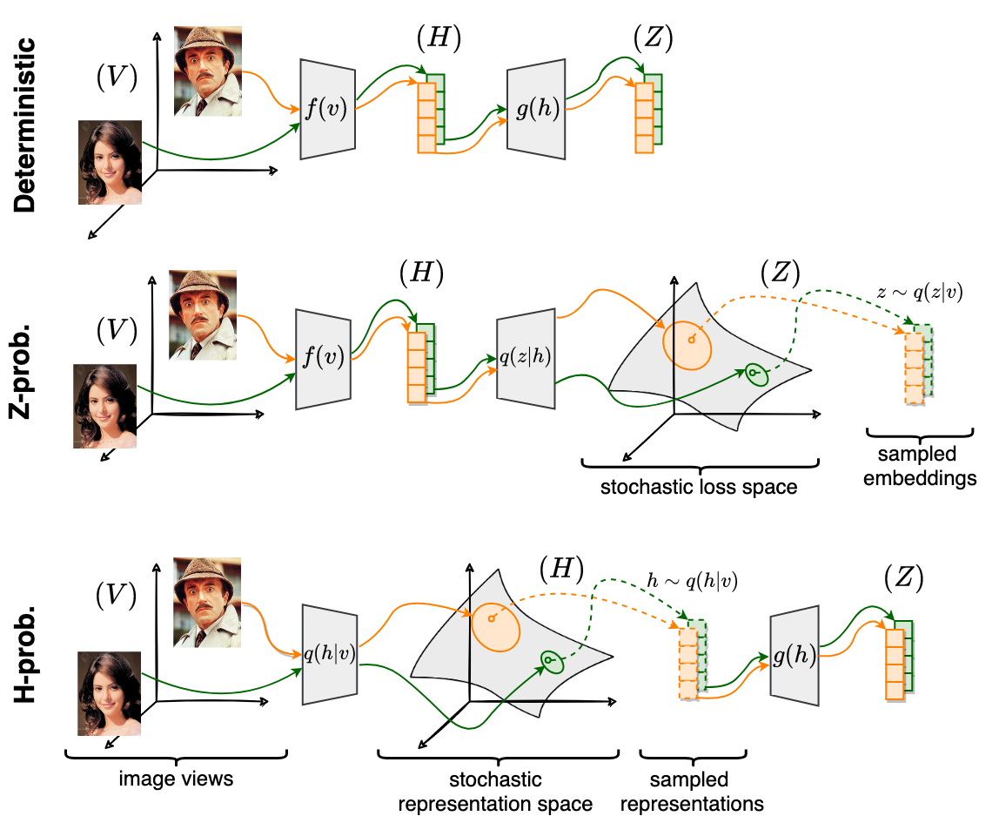

# Enhancing out-of-distribution detection through stochastic embeddings in self-supervised learning
Original implementation of paper: **"Enhancing out-of-distribution detection through stochastic embeddings in self-supervised learning"** authored by Denis Janiak, Jakub Binkowski, Piotr Bielak, and Tomasz Kajdanowicz.  
The paper is currently under review.


Our study directly introduces stochasticity into 
the feature decorrelation-based methods 
by parameterizing the conditional density of a model, 
i.e., predicting the parameters of the embeddings' distribution. 
In essence, our goal is twofold: first, 
to adhere to the stochastic assumptions 
required by the information-theoretic framework, 
and second, to harness this stochasticity to enhance our ability 
to detect out-of-distribution examples and handle uncertainty. 

We introduce two variations of the model, 
which differ in terms of choice of the stochastic space and, 
therefore, the variational conditional density. 
Figure above depicts the workflow of probabilistic (stochastic) variations 
of self-supervised learning.

## Installation
All experiments were performed using Python 3.10, using NVIDIA A40 or NVIDIA TITAN RTX GPUs, with CUDA 12.2.  
The requirements file contains the list of all of a project's dependencies.
We provide direct dependencies in `requirements.in` file and compiled dependencies (with `pip-compile`) in 
`requirements-cpu.txt` and `requirements-gpu.txt` files.  
To install these dependencies use the following command:
  ```shell
   pip install -r requirements-gpu.txt
  ```
If you encounter any problems with dependencies, you can try to compile the direct
dependencies from `requirements.in` file yourself with `pip-compile` from `pip-tools`. 


## Reproducibility
We utilize DVC pipelines to ensure reproducibility in our experiments. 
All scripts and configurations are stored in the `src/experiments/` directory. 
The definition of the pipeline can be located in the dvc.yaml file.

To reproduce all experiments with DVC, simply use the command below:
  ```shell
   dvc repro
  ```

You can also reproduce partial results. To do so, choose the specific stage (`stage_name`) from DVC.yaml file and run in with:
  ```shell
   dvc repro@stage_name
  ```

The following stages are specified inside the DVC.yaml file:
- `imagenet_{ssl,ssl_bayes_h_barlow,ssl_bayes_z_barlow,ssl_bayes_h_vicreg,bayes_z_vicreg}`: runs the self-supervised pretraining on ImageNet
- `evaluate_semi_supervised_{1pct,10pct}`:  evaluates the models, pretrained on ImageNet, on semi-supervised downstream task for either 1% or 10% of labels
- `pre_embed_datasets`: embeds the dataset for fast downstream evaluation (transfer learning and linear)
- `evaluate_linear_probing`: evaluates the models, pretrained on ImageNet, on linear and transfer learning tasks
- `summarize_linear_probing`: summarizes the results from `evaluate_linear_probing` stage
- `ablation_cifar10_{barlow_twins_ssl_bayes_h,mc_barlow_twins_ssl_bayes_z,mc_vicreg_ssl_bayes_h,mc_vicreg_ssl_bayes_z}`: runs the ablation study on CIFAR-10 dataset using the stochastic SSL methods
- `ood_detection_study`: runs the OOD detection task using with CIFAR-10 dataset as IN distribution data and models from the ablation study above

Configs are compiled dynamically using [hydra](https://hydra.cc/docs/intro/) hierarchical configuration. 
All configs are stored in the `src/experiments/conf/` directory, 
whereas the Python scripts are placed in the `src/experiments/scripts/`.  
To obtain the full configuration without running the script you can use the [Compose API](https://hydra.cc/docs/advanced/compose_api/), e.g.,
  ```python
with initialize(config_path="src/experiments/conf", version_base=None):
    cfg = compose(
        config_name="config",
        overrides=[
            "+model/task/ssl@train=ssl",
            "+model/task@finetune=finetune",
        ],
    )
  ```

## Citation
Soon